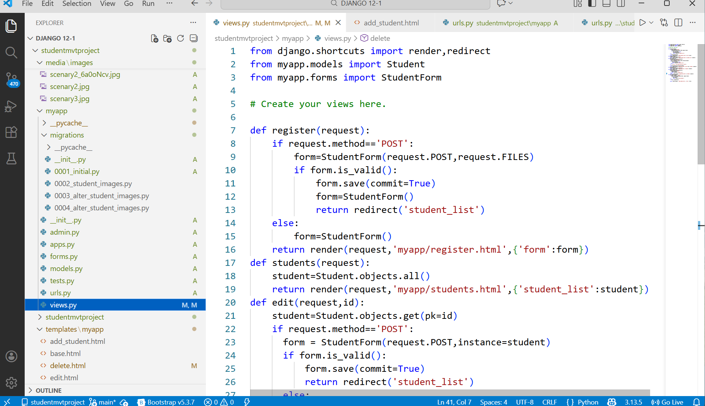

STUDENT DATA MANAGEMENT PORTAL (Django Mini Project)

## Description
A web-based Student Data Management Portal built using Django.  
This project performs basic CRUD operations and helps understand full-stack development fundamentals.

## Features
- Created Models,Forms using class Student,performed function based views.
- Add student details
- connected to MYSQL Data base
- View student list
- Update student records
- Delete student records
- Upload student photo
- Admin panel for management

## Technologies Used
- Python
- Django
- HTML
- Bootstrap
- MYSQL

## How to Run
1. Clone the repository
2. Install Django  
   pip install django
3. Run migrations  
   python manage.py migrate
4. Start server  
   python manage.py runserver
5. Open browser  
   http://127.0.0.1:8000/

## Author
 CH.KRISHNA TEJA SRI

]

 
